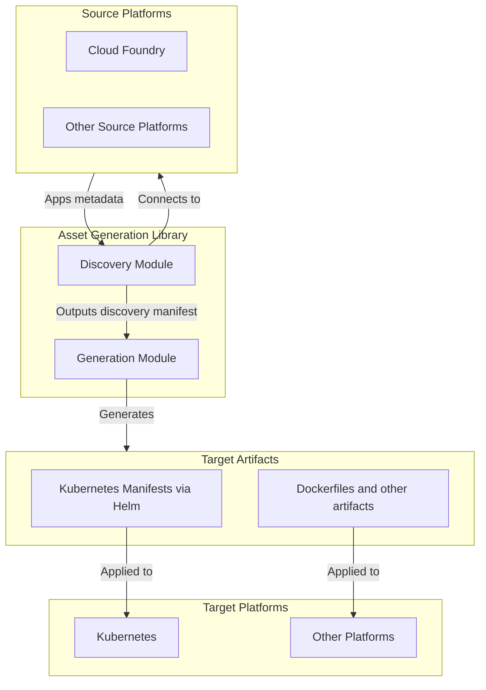
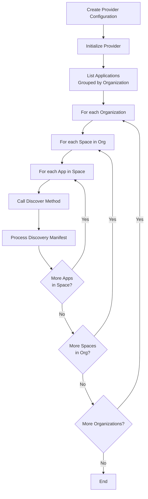
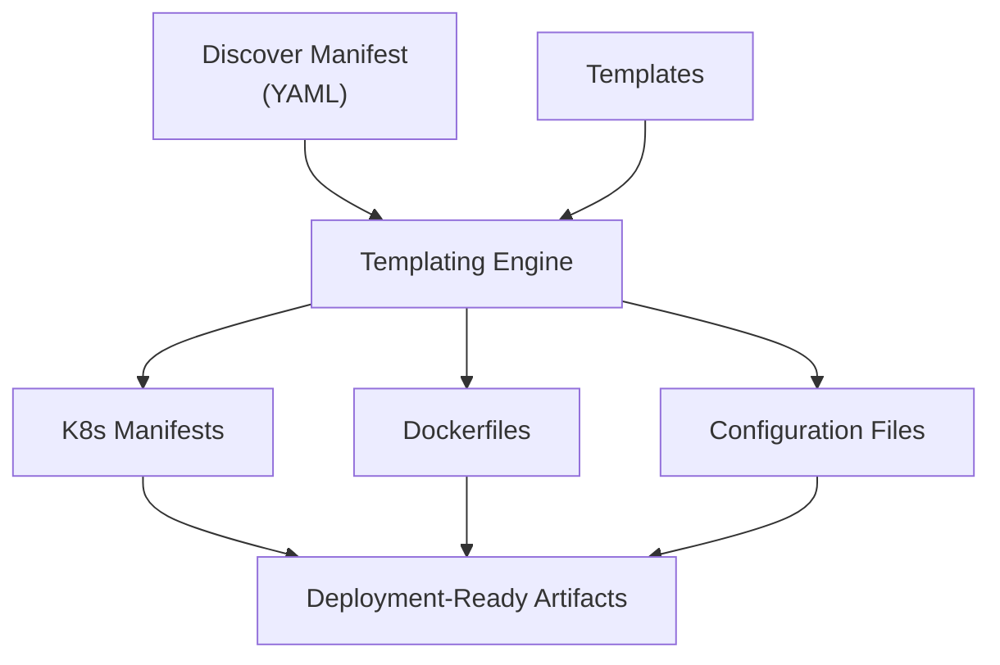

# asset-generation
`asset-generation` is a Go library that automates the discovery and
transformation of applications deployed on source platforms (e.g., Cloud
Foundry) with [Konveyor](https://konveyor.io/). This library facilitates
application modernization and migration by automating the discovery of existing
platform assets and generating deployment artifacts for target environments.

## Code of Conduct
Refer to Konveyor's Code of Conduct
[here](https://github.com/konveyor/community/blob/main/CODE_OF_CONDUCT.md).

## Installation 

To add the `asset-generation` library to your project, use:

```bash
go get github.com/konveyor/asset-generation
```

## How It Works

The library operates in two main phases:

* `Discovery` connects to your source platforms (such as Cloud Foundry) to
  identify and extract detailed information about applications and their
  associated resources.

* `Generation` takes the discovered data and transforms it into deployment-ready
  assets, such as Kubernetes manifests, enabling seamless application
  re-platforming.

### Architecture Overview



## Usage example

Here's how to use the Cloud Foundry provider to discover applications:



```go
import(
    cfProvider "github.com/konveyor/asset-generation/pkg/providers/discoverers/cloud_foundry"
)
// Create the Cloud Foundry provider configuration
cfg := &cfProvider.Config{
    CloudFoundryConfig: cfCfg,  // Your Cloud Foundry connection config
    OrgNames:           orgs,   // List of Cloud Foundry organizations (required for live discovery, ignored for local manifests)
    SpaceNames:         spaces, // List of Cloud Foundry spaces (empty = all spaces)
}

// Initialize the Cloud Foundry provider
p, err := cfProvider.New(cfg, &logger, concealSensitiveData)
if err != nil {
    return err
}

// List applications grouped by organization
appListPerOrg, err := p.ListApps()
if err != nil {
    return fmt.Errorf("failed to list apps: %w", err)
}

// Iterate through organizations
// Each organization contains apps from multiple spaces
for orgName, appsFromAllSpaces := range appListPerOrg {
        // appsFromAllSpaces contains all apps across all spaces in this org
        for _, app := range appsFromAllSpaces {
            appRef, ok := app.(cfProvider.AppReference)
            if !ok {
                return fmt.Errorf("unexpected type for app list: %T", app)
            }
            
            // Each AppReference includes org, space, and app information
            logger.Info("Processing application", 
                "org", appRef.OrgName, 
                "space", appRef.SpaceName, 
                "app", appRef.AppName)
            
            discoverResult, err := p.Discover(appRef)
            if err != nil {
                return err
            }
            
            // Process the discovery result
            fmt.Printf("Discovered app %s in org %s, space %s\n", 
                appRef.AppName, appRef.OrgName, appRef.SpaceName)
        }
}
```

### Discovery
The discovery phase collects metadata from source platforms. This results in a
structured YAML manifest, the _Discovery Manifest_, a detailed listing of
applications and their metadata, which can be used for further analysis or
transformation.

#### Input Manifest Support

The library is able to process manifests in multiple ways:

1. **Single Application Manifests** - Direct application definition of an individual app deployment
2. **Cloud Foundry Manifests** - Full CF manifests containing multiple applications under an `applications` array
3. **Multiple Manifest Files in Folders** - When provided with a directory path, the library searches through all manifest files (both single application manifests and Cloud Foundry manifests) to find the application by name

The discovery engine intelligently detects the manifest format and uses the appropriate parsing strategy:

- **Single Application Format**: Parses the YAML directly as an application manifest
  ```yaml
  name: my-app
  memory: 512M
  instances: 2
  buildpacks: [java_buildpack]
  env:
    DATABASE_URL: postgres://...
  ```
- **Cloud Foundry Format**: When single application parsing fails, automatically
  falls back to parsing as a Cloud Foundry manifest and extracts the **first application**
  from the applications array (**current implementation limitation**)
  ```yaml
  version: 1
  applications:
    - name: my-app-1      # This application will be selected
      memory: 512M
      instances: 2
      buildpacks: [java_buildpack]
      env:
        DATABASE_URL: postgres://...
    - name: my-app-2      # This application will be ignored
      memory: 256M
      instances: 1
      buildpacks: [java_buildpack]
  ```
- **Multiple Manifest Files**: When provided with a directory path, **you must
  specify an application name**. The library iterates through all manifest files
  (`.yml` and `.yaml`) in the directory, parsing each one to find the
  application with the specified name. Each file can be either a single
  application manifest or a Cloud Foundry manifest. Once the correct file is
  found (by matching the app name), it processes that specific manifest file
  using the same parsing logic as above (Application manifest first, then
  Cloud Foundry manifest taking the first application).
  ```
  manifests/
    ├── app-1-manifest.yml     # Single app: name: app-1
    ├── app-2-manifest.yml     # Single app: name: app-2  
    ├── cf-apps-manifest.yml   # CF format with applications: [app-3, app-4]
    └── other-file.txt         # Ignored (not a manifest)
  
  # To discover app-2, you must specify "app-2" as the application name
  # The library will find and process app-2-manifest.yml
  ```

**Important Notes**:
- **Application name is REQUIRED only for Directory-based discovery** (when searching through multiple manifest files in a folder)
- **Current implementation limitation**: When processing Cloud Foundry format manifests with multiple applications, only the **first application** in the applications array will be processed.

### Discover manifest examples

<table style="width: 100%;">
<tr>
<th> CF Manifest<br/> (input) </th>
<th> Discovery Manifest <br/> (output) </th>
</tr>
<tr>
  <td>

  ```yaml
    name: cf-nodejs
    memory: 512M
    instances: 1
    random-route: true
  ```

  </td>
  <td>

  ```yaml
   name: cf-nodejs
    randomRoute: true
    timeout: 60
    memory: 512M
    healthCheck:
      endpoint: /
      timeout: 1
      interval: 30
      type: port
    readinessCheck:
      endpoint: /
      timeout: 1
      interval: 30
      type: process
    instances: 1
  ```
  </td>
</tr>

</table>

#### Sensitive information

The discovery process automatically detects and secures sensitive information found in applications. Specifically, it extracts:

- **Docker credentials**: Docker registry usernames from the `docker.username` field
- **Service credentials**: Any credentials found in service bindings under the `credentials` parameter

When sensitive data is detected, the discover process:
1. Generates a unique UUID for each piece of sensitive information
2. Stores the original sensitive data in a separate secrets map using the UUID as the key
3. Replaces the sensitive value in the main discovery manifest with a UUID reference in the format `$(UUID)`

This approach ensures that sensitive data is separated from the main configuration while maintaining referential integrity.

**Example:**

Given a Cloud Foundry manifest with sensitive information:

```yaml
name: my-app
docker:
  image: myregistry/myapp:latest
  username: secret-docker-user
services:
  - name: my-database
    parameters:
      "credentials": "{\"username\": \"secret-username\",\"password\": \"secret-password\"}"
```

The discovery process would produce:

**Discovery Manifest** (with sensitive data replaced):
```yaml
name: my-app
docker:
  image: myregistry/myapp:latest
  username: $(a1b2c3d4-e5f6-7890-abcd-ef1234567890)
services:
  - name: my-database
    credentials: $(b2c3d4e5-f6g7-8901-bcde-f23456789012)
```

**Secrets Map** (containing the actual sensitive data):
```yaml
a1b2c3d4-e5f6-7890-abcd-ef1234567890: secret-docker-user
b2c3d4e5-f6g7-8901-bcde-f23456789012: '{"username": "secret-username","password": "secret-password"}'
```

#### Cloud Foundry Manifest vs Discovery Manifest: Structure Differences

For simple CF manifests, the resulting Discovery manifest is nearly identical.
However, when more complex fields (such as `type`) are included, we transform the
structure to be clearer, more consistent, and easier for the asset generation
library to process.

Below an example showing how the presence or absence of the type field affects
the Discovery manifest output.
<table style="width: 100%;">
<tr>
<th> CF Manifest<br/> (input) </th>
<th> Discovery Manifest <br/> (output) </th>

</tr>
<tr>
  <td>

  ```yaml
  name: app-with-inline-process-no-type
  disk_quota: 512M
  memory: 500M
  timeout: 10
  docker:
    image: myregistry/myapp:latest
    username: docker-registry-user
  ```
  </td>
  <td>
  <strong>Content</strong>

  ```yaml
  name: app-with-inline-process-no-type
  timeout: 10
  docker:
    image: myregistry/myapp:latest
    username: $(73dc8ee8-746f-4f91-a520-1f6e80ce3a3f)
  disk: 512M
  memory: 500M
  instances: 1
  ```
  <strong>Secrets</strong>

  ```yaml
  73dc8ee8-746f-4f91-a520-1f6e80ce3a3f: docker-registry-user
  ```
  </td>
</tr>
<tr>
  <td>

  ```yaml
  name: app-with-inline-process-only-type
  disk_quota: 512M
  memory: 500M
  timeout: 10
  docker:
    image: myregistry/myapp:latest
    username: docker-registry-user
  type: web
  ```
  </td>
  <td>
  <strong>Content</strong>

  ```yaml
  name: app-with-inline-process-only-type
  processes:
    - type: web
      timeout: 10
      disk: 512M
      memory: 500M
      healthCheck:
        endpoint: /
        timeout: 1
        interval: 30
        type: port
      readinessCheck:
        endpoint: /
        timeout: 1
        interval: 30
        type: process
      instances: 1
      logRateLimit: 16K
  timeout: 60
  docker:
    image: myregistry/myapp:latest
    username: $(7d8ff0a4-e93c-4e1f-9fa3-aa5536884930)
  memory: ""
  instances: 1
  ```
  <strong>Secrets</strong>

  ```yaml
  7d8ff0a4-e93c-4e1f-9fa3-aa5536884930: docker-registry-user
  ```
  </td>
</tr>
</table>

When the input CF manifest does not specify a type, the resulting Discovery
manifest defines basic properties like `Memory`, `DiskQuota`, and `HealthCheck`
at the top level and leaves `Processes` as null.

However, when `type: web` is included in the input CF manifest, the Discovery
manifest changes in the following key ways:
* A new Processes section is generated with `Type`, `Memory`, `DiskQuota`,
  `Instances`, and other runtime configurations moved under the `Processes`
  entry.

This reflects a shift from a flat representation of app configuration to a
process-oriented representation, which is more detailed and aligned with
Discovery's internal model when type is explicitly specified.


### Generation

The generation phase transforms the discovered application metadata into
deployment-ready artifacts for target platforms. This process takes the
_Discovery Manifest_ from the discovery phase and applies it to templates (such
as Helm charts) to produce platform-specific deployment configurations. The
generation process uses templating engines like Helm to enable flexible and
reusable generation of manifests that can be customized for different deployment
scenarios.

The library currently supports:
- **Kubernetes deployments** via Helm chart templating
- **Dockerfiles** or **Configuration files** tailored for different target
  environments

#### Flow

