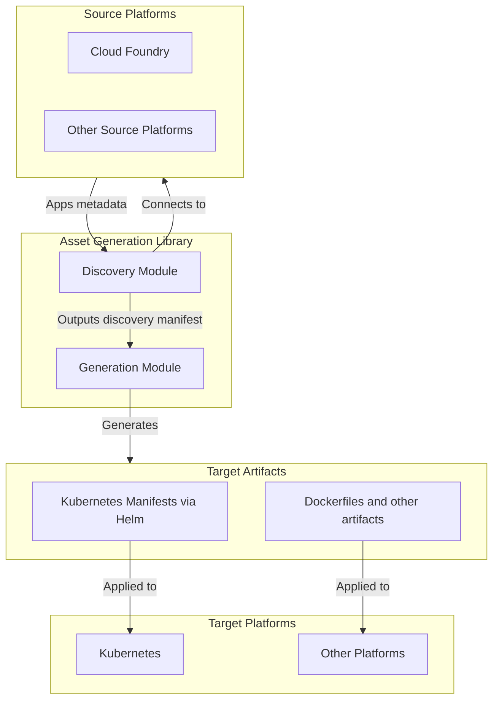
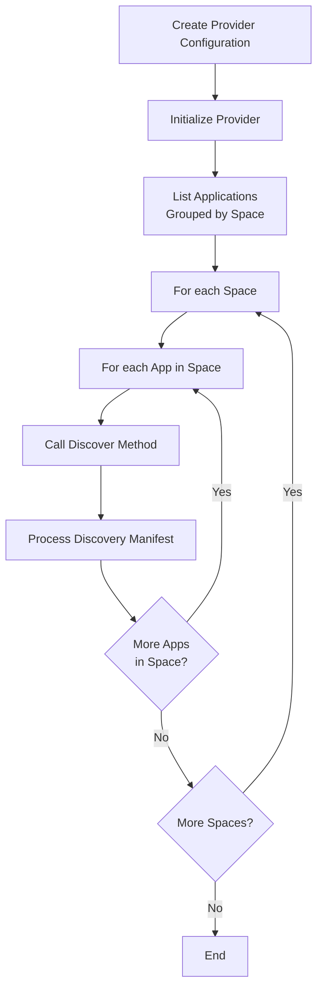
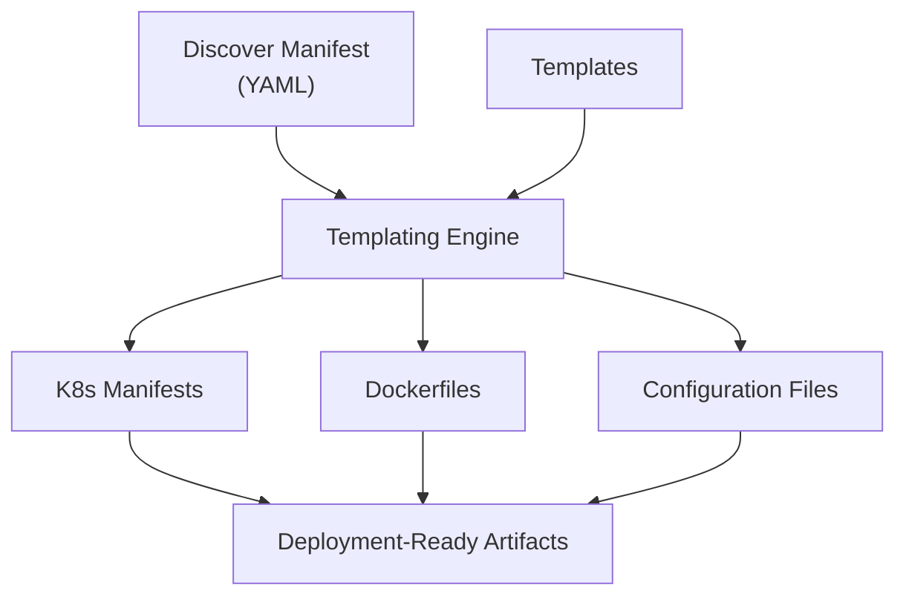

# asset-generation
`asset-generation` is a Go library that automates the discovery and
transformation of applications deployed on source platforms (e.g., Cloud
Foundry) with [Konveyor](https://konveyor.io/). This library facilitates
application modernization and migration by automating the discovery of existing
platform assets and generating deployment artifacts for target environments.

## Code of Conduct
Refer to Konveyor's Code of Conduct
[here](https://github.com/konveyor/community/blob/main/CODE_OF_CONDUCT.md).

## Installation 

To add the `asset-generation` library to your project, use:

```bash
go get github.com/konveyor/asset-generation
```

## How It Works

The library operates in two main phases:

* `Discovery` connects to your source platforms (such as Cloud Foundry) to
  identify and extract detailed information about applications and their
  associated resources.

* `Generation` takes the discovered data and transforms it into deployment-ready
  assets, such as Kubernetes manifests, enabling seamless application
  re-platforming.

### Architecture Overview


```mermaid
flowchart TD
  subgraph asset_generation["Asset Generation Library"]
    C["Discovery Module"]
    D["Generation Module"]
  end

  subgraph Source_Platforms["Source Platforms"]
    E["Cloud Foundry"]
    F["Other Source Platforms"]
  end

  subgraph Target_Artifacts["Target Artifacts"]
    G["Kubernetes Manifests via Helm"]
    H["Dockerfiles and other artifacts"]
  end

  subgraph Target_Platforms["Target Platforms"]
    L["Kubernetes"]
    M["Other Platforms"]
  end

  %% Connections
  C -- Connects to --> Source_Platforms
  Source_Platforms -- Apps metadata --> C

  C -- Outputs discovery manifest --> D
  D -- Generates --> Target_Artifacts

  G -- Applied to --> L
  H -- Applied to --> M
```

## Usage example

Here’s how to use the Cloud Foundry provider to discover applications by space:


```mermaid
flowchart TD
    B[Create Provider Configuration]
    B --> C[Initialize Provider]
    C --> D[List Applications<br/>Grouped by Space]
    D --> E[For each Space]
    E --> F[For each App in Space]
    F --> G[Call Discover Method]
    G --> H[Process Discovery Manifest]
    H --> I{More Apps<br/>in Space?}
    I -- Yes --> F
    I -- No --> J{More Spaces?}
    J -- Yes --> E
    J -- No --> K[End]
```

```go
import(
    cfProvider "github.com/konveyor/asset-generation/pkg/providers/discoverers/cloud_foundry"
)
// Create the Cloud Foundry provider configuration
cfg := &cfProvider.Config{
    CloudFoundryConfig: cfCfg,  // Your Cloud Foundry connection config
    SpaceNames:         spaces, // List of Cloud Foundry spaces to discover
}

// Initialize the Cloud Foundry provider with the config and a logger
p, err := cfProvider.New(cfg, &log.Logger{})
if err != nil {
    return err
}

// List applications grouped by space
appListPerSpace, err := p.ListApps()
if err != nil {
    return fmt.Errorf("failed to list apps by space: %w", err)
}

// Iterate over each space and its applications
for space, appList := range appListPerSpace {
    for _, appName := range appList.([]string) {
        // Prepare input parameters for discovery
        input := cfProvider.DiscoverInputParam{
            SpaceName: space,
            AppName:   appName,
        }

        discoverResult, err := p.Discover(input)
        if err != nil {
            return err
        }
        // Use the discovery result as needed
        fmt.Printf("Discovered app %s in space %s: %+v\n", appName, space, discoverResult)
    }
}
```

### Discovery
The discovery phase collects metadata from source platforms. This results in a
structured YAML manifest, the _Discovery Manifest_, a detailed listing of
applications and their metadata, which can be used for further analysis or
transformation.

Example:

<table style="width: 100%;">
<tr>
<th> CF Manifest<br/> (input) </th>
<th> Discovery Manifest <br/> (output) </th>
</tr>
<tr>
  <td>

  ```yaml
    name: cf-nodejs
    memory: 512M
    instances: 1
    random-route: true
  ```

  </td>
  <td>

  ```yaml
   name: cf-nodejs
    randomRoute: true
    timeout: 60
    memory: 512M
    healthCheck:
      endpoint: /
      timeout: 1
      interval: 30
      type: port
    readinessCheck:
      endpoint: /
      timeout: 1
      interval: 30
      type: process
    instances: 1
  ```
  </td>
</tr>

</table>

#### Sensitive information

The discovery process automatically detects and secures sensitive information found in applications. Specifically, it extracts:

- **Docker credentials**: Docker registry usernames from the `docker.username` field
- **Service credentials**: Any credentials found in service bindings under the `credentials` parameter

When sensitive data is detected, the discover process:
1. Generates a unique UUID for each piece of sensitive information
2. Stores the original sensitive data in a separate secrets map using the UUID as the key
3. Replaces the sensitive value in the main discovery manifest with a UUID reference in the format `$(UUID)`

This approach ensures that sensitive data is separated from the main configuration while maintaining referential integrity.

**Example:**

Given a Cloud Foundry manifest with sensitive information:

```yaml
name: my-app
docker:
  image: myregistry/myapp:latest
  username: secret-docker-user
services:
  - name: my-database
    parameters:
      "credentials": "{\"username\": \"secret-username\",\"password\": \"secret-password\"}"
```

The discovery process would produce:

**Discovery Manifest** (with sensitive data replaced):
```yaml
name: my-app
docker:
  image: myregistry/myapp:latest
  username: $(a1b2c3d4-e5f6-7890-abcd-ef1234567890)
services:
  - name: my-database
    credentials: $(b2c3d4e5-f6g7-8901-bcde-f23456789012)
```

**Secrets Map** (containing the actual sensitive data):
```yaml
a1b2c3d4-e5f6-7890-abcd-ef1234567890: secret-docker-user
b2c3d4e5-f6g7-8901-bcde-f23456789012: '{"username": "secret-username","password": "secret-password"}'
```

#### Cloud Foundry Manifest vs Discovery Manifest: Structure Differences

For simple CF manifests, the resulting Discovery manifest is nearly identical.
However, when more complex fields (such as `type`) are included, we transform the
structure to be clearer, more consistent, and easier for the asset generation
library to process.

Below an example showing how the presence or absence of the type field affects
the Discovery manifest output.
<table style="width: 100%;">
<tr>
<th> CF Manifest<br/> (input) </th>
<th> Discovery Manifest <br/> (output) </th>
<th> Discovery Manifest Secrets<br/> (output) </th>

</tr>
<tr>
  <td>

  ```yaml
  name: app-without-type
  disk_quota: 512M
  memory: 500M
  timeout: 10
  docker:
    image: myregistry/myapp:latest
    username: docker-registry-user
  ```

  </td>
  <td>

  ```yaml
  docker:
    image: myregistry/myapp:latest
    username: $(1fa00504-ad2b-4bcb-a565-2295bded191c)
  healthCheck:
    endpoint: /
    interval: 30
    timeout: 1
    type: port
  memory: 500M
  name: app-without-type
  readinessCheck:
    endpoint: /
    interval: 30
    timeout: 1
    type: process
  routes: {}
  timeout: 10
  ```
  </td>
  <td>

  ```yaml
  1fa00504-ad2b-4bcb-a565-2295bded191c: docker-registry-user
  ```
  </td>
</tr>
<tr>
  <td>

  ```yaml
  name: app-with-type
  disk_quota: 512M
  memory: 500M
  timeout: 10
  docker:
    image: myregistry/myapp:latest
    username: docker-registry-user
  type: web
  ```
  </td>
  <td>

  ```yaml
  docker:
      image: myregistry/myapp:latest
      username: $(09796cd7-c316-4235-8c33-4a94484497d0)
  healthCheck:
    endpoint: /
    interval: 30
    timeout: 1
    type: port
  name: app-with-type
  processes:
    - healthCheck:
       endpoint: /
        interval: 30
        timeout: 1
        type: port
      instances: 1
      logRateLimit: 16K
      memory: 500M
      readinessCheck:
        endpoint: /
        interval: 30
        timeout: 1
        type: process
  type: web
  routes: {}
  timeout: 10
  ```
  </td>
  <td>
  ```yaml
  1fa00504-ad2b-4bcb-a565-2295bded191c: docker-registry-user
  ```
  </td>
</tr>
</table>

When the input CF manifest does not specify a type, the resulting Discovery
manifest defines basic properties like `Memory`, `DiskQuota`, and `HealthCheck`
at the top level and leaves `Processes` as null.

However, when `type: web` is included in the input CF manifest, the Discovery
manifest changes in the following key ways:
* A new Processes section is generated with `Type`, `Memory`, `DiskQuota`,
  `Instances`, and other runtime configurations moved under the `Processes`
  entry.

This reflects a shift from a flat representation of app configuration to a
process-oriented representation, which is more detailed and aligned with
Discovery's internal model when type is explicitly specified.


### Generation

The generation phase transforms the discovered application metadata into
deployment-ready artifacts for target platforms. This process takes the
_Discovery Manifest_ from the discovery phase and applies it to templates (such
as Helm charts) to produce platform-specific deployment configurations. The
generation process uses templating engines like Helm to enable flexible and
reusable generation of manifests that can be customized for different deployment
scenarios.

The library currently supports:
- **Kubernetes deployments** via Helm chart templating
- **Dockerfiles** or **Configuration files** tailored for different target
  environments

#### Flow

```mermaid
flowchart TD
    A["Discover Manifest<br/>(YAML)"] 
    B[Templates]
    A --> D[Templating Engine]
    B --> D[Templating Engine]
    D --> E[K8s Manifests]
    D --> F[Dockerfiles]
    D --> G[Configuration Files]
    E --> H[Deployment-Ready Artifacts]
    F --> H
    G --> H
```